<picture>
  <source media="(prefers-color-scheme: dark)" srcset="assets/header-dark.svg">
  
</picture>

I build backend systems and lead the team that ships them — from data model and API
design to deployment. Java and Spring on the server, TypeScript and Python around it.
I like boring, readable code and systems that are easy to reason about at 2 AM.

### Stack

**Languages** 

**Backend** 

**Data** 

**Tooling** 

### Highlight

**[opencode-commandcode-tools](https://github.com/Dung-L3/opencode-commandcode-tools)** — Single-file installer that wires Command Code into OpenCode as a provider. No clone, no dependencies, and it validates your API key before writing anything.

`JavaScript` · `MIT` · Windows / Linux / macOS

### Activity

  

### Contact

